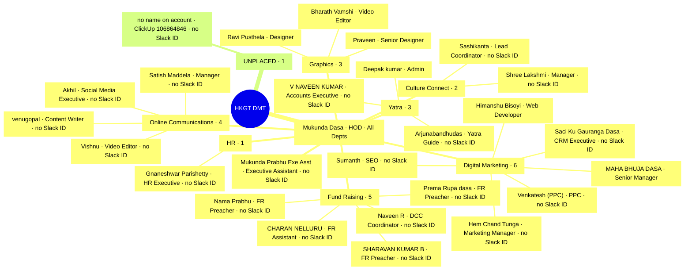

<!-- GENERATED — never hand-edit -->
# Mind map — HKGT DMT org structure

Source: `docs/ORG-STRUCTURE.md` (STATUS CONFIRMED 2026-08-28). Generated by
`/mindmap org-structure --whimsical` on 2026-08-28.
Whimsical mirror: https://whimsical.com/7M4QFiT2MCLRaZG8HT6eBC (workspace "DMT").
The mirror is generated FROM this file — edit neither; fix docs/ORG-STRUCTURE.md
and re-run /mindmap.

**Reading it.** Departments hang under Mukunda Dasa because he is the sole `HOD`
across all of them (`All Depts` is a wildcard) — every department-inferred
assignment resolves to him. `Manager` and `Senior Manager` are designations, not
department heads. `no Slack ID` marks a person the desk cannot @-mention.

**Counts.** 24 people across 7 departments, plus 2 on `All Depts` = 26 placed;
1 UNPLACED. 36 nodes, 35 edges. Slack-taggable: 7 of 27.
