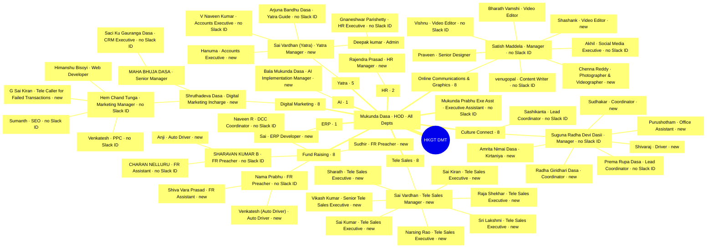

<!-- GENERATED — never hand-edit -->
# Mind map — HKGT DMT org structure

Source: the Principal's Whimsical board https://whimsical.com/7M4QFiT2MCLRaZG8HT6eBC
(read back 2026-08-28) via `docs/ORG-STRUCTURE.md`. Regenerate with `/mindmap org-structure`.
The board is the Principal's editing surface — fix it there, then re-run; never
hand-edit this file.

**51 people · 9 departments · 73 lines.** Departments hang under
Mukunda Dasa because `All Depts` / `HOD` is a wildcard heading all of them; the nesting
below each head is the reporting line the Principal drew on the board.

`no Slack ID` = in ClickUp but not matched to Slack (cannot be @-mentioned).
`new` = on the board only, with no ClickUp account yet (cannot be assigned a task).

**Not shown:** Ravi Pusthela, absent from this board revision but retained in
docs/ORG-STRUCTURE.md pending the Principal's word — see that file.
