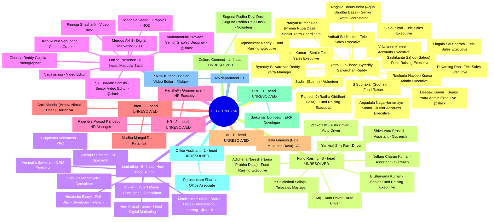

<!-- GENERATED — never hand-edit -->
# Mind map — HKGT DMT org structure (Sep 2026)

Source: `docs/ORG-STRUCTURE.md` (CONFIRMED 2026-09-23), built from the Principal's
`Org_Structre_RR_Sep_2026.xlsx`. Generated by `/mindmap org-structure --whimsical`.

**Reading it.** Departments are top level with their routing head named; `head
UNRESOLVED` means the sheet gives no single head and department work routes to MKCD
(the Principal) instead. `@slack` marks the only 6 people the desk can @-mention —
the other 44 must be named in plain text. Spiritual names are in parentheses.

**Counts.** 50 people · 10 departments + 1 unplaced · 3 heads resolved, 7 unresolved ·
62 nodes, 61 edges · Slack-taggable 6 of 50.
